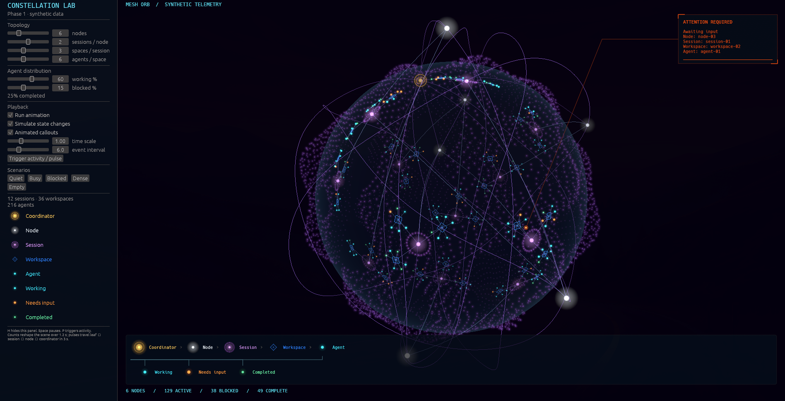

# Mesh Orb — phase 1 experiment

This is a standalone wgputests experiment, based on the Orbital Sphere scene.
It uses synthetic replacement state only: no Herdr library, daemon, RPC,
Tailscale registration, repository binding or project names. The accepted
brainstorm is `projects/herdr-tailmesh/Brainstorm/Orb visualization` in AI Core.
Phase 2 will adapt the proven mesh observation/projection layer after visual
iteration. The user has approved merging this gallery experience into main;
it remains a synthetic prototype, with production mesh integration deferred.



## Run

```sh
cargo run --locked
```

Mesh Orb opens by default. The original four gallery scenes remain accessible
from the selector or keys 1–4; key 5 returns to the experiment. `H` hides/restores
the debug panel, `Space` pauses/resumes, `P` triggers activity, and Escape exits.
The optional Linux clipboard worker is disabled: a rendered smoke reproduced
a `smithay-clipboard` / Wayland primary-selection teardown crash. Numeric
controls still support direct keyboard entry; clipboard copy/paste is not
part of this prototype. Windows/macOS clipboard feature selection is unchanged.

On Windows use the native exe; the existing winit/wgpu backend choice continues
to cover Windows, macOS and Linux. There is no browser or external renderer.

## First-cut visual grammar

- One gold coordinator, distinguished by its small orbiting crown.
- Pearl-white nodes moving on six fine 3D lattice orbits. Stable seeded locations
  avoid reshuffling existing objects as counts change; no real identities appear.
- Violet session hubs on the inner particle globe, with concentric dot halos.
  Nodes own stable surface territories selected progressively from equal-area
  Fibonacci candidates, filling the largest remaining angular gaps. Clusters
  rotate with the globe independently of satellite orbits; adding/removing nodes
  preserves existing territories and scoped entity placement.
- Royal-blue diamond workspace hubs arranged around each session, with full rings
  of agent dots around them. Successive child slots fill opposite sides and gaps
  around the full circle, so small counts occupy the available area while earlier
  positions stay fixed. Wider spacing separates sessions, workspaces and leaves;
  faint spokes connect agents to their workspace. Cyan agents work/breathe, amber
  agents are blocked, green agents are completed. Agent cores are crisp with
  compact halos, and the decorative field is dimmed for semantic contrast.
- Fine connections from session clusters to their node, then curved paths
  from nodes to the coordinator. Three-second colored ripples/pulses travel
  from a changed leaf through its session/node to the gold root.
- Additive core/halo particles use the source Orbital Sphere WGSL renderer.
  Dimmer source particles supply the ambient geometric sphere pattern. Rear
  clusters, pulses and connections fade smoothly in brightness, with weaker halos
  and modest dot-size falloff. A faint alpha-blended blue atmospheric shell sits
  between rear and front layers; rear clusters remain visible through the globe.
  Depth changes preserve status hues and feather across the middle of the globe.
  The original Orbital Sphere retains its original glow and pixel-size behavior.
- An enlarged visual key uses the sphere's own glyph geometry and linear colors:
  gold core with dotted crown and root ring, glowing pearl-white node, violet
  session core with dotted halo, hollow workspace diamond with faint center,
  and compact agent glows. Working/needs-input samples share the scene's fast/slow
  breathing; completed stays steady. Samples face forward for recognition, with
  magnified details and HUD radial meshes approximating the WGSL core/halo profile.
  The key stays visible in the scene when the lab panel is
  hidden. Hierarchy and agent states occupy separate rows that wrap on narrow
  windows; an undersized view shows an enlarge-view hint rather than overlapping
  the title/footer or squeezing labels. Hierarchy order is Coordinator → Node → Session → Workspace → Agent,
  with a bracket from Agent to Working / Needs input / Completed. Nodes are the
  orbiting pearl-white satellites; agents are the smaller state-colored dots around
  each workspace diamond. Event cards leave room for the key and footer; very short viewports
  suppress cards when there is insufficient room.
- Event callouts track a projected 3D anchor with elbow leaders, corner
  brackets, a typewriter heading, scan line, entrance easing and fade out. They
  remain fully opaque until 8.8 seconds and fade during the final 1.2 seconds of
  their ten-second lifetime. Existing cards keep their edge as newer events arrive.
  Cards drift as flat screen-facing overlays and grow to fit wrapped text. They
  stack independently along the two edges (one column in narrow views); only
  cards that fit above the key are shown. Attention cards show node, session,
  workspace and agent names on separate lines, using stable scoped synthetic
  names in phase 1. Names are captured with the event. Perspective 3D cards and
  richer typography remain visual iteration opportunities.

## Debug controls

Per-node/session/workspace controls set up to 24 nodes, four sessions per
node, eight workspaces per session and 16 agents per workspace. Working and
blocked percentages seed the agent distribution; the rest are completed.
Optional simulated events then change individual agent states, so the displayed
counts can diverge from the seeded percentages. Turning simulation off freezes
state evolution while the ambient animation continues.

Membership changes fade and expand/collapse over 1.2 seconds with quintic easing.
Reversing a change preserves the currently visible opacity. Completed departures
are removed; entity positions remain stable. Playback pauses the simulation
clock, including fades, callouts and pulses. Manual controls can still change
state while paused, and the transitions continue on resume.

Quiet, Busy, Blocked, Dense and Empty presets exercise common visual scenarios.
Zero nodes leaves only the coordinator and ambient lattice. Zero sessions,
workspaces or agents produces a valid truncated hierarchy. Arrival/departure and
state changes generate callouts; the rolling queue is capped at three and
expires after ten simulation seconds (at the default playback speed, ten seconds). One pulse per node is retained, and removal of its
source cancels the pulse. Multiple blocked agents remain amber simultaneously,
and the blocked total includes every one of them. "Needs input" in the key is
this prototype's blocked state. Callout expiration does not resolve an agent;
a fourth event replaces the oldest card, and a newer event on the same node
replaces its pulse. There is no persistent per-agent input notification queue
or input interaction yet. The coordinator is separate from all node counts.

## Structure and checks

- `mesh_model.rs`: bounded synthetic hierarchy, stable identity, lifetimes,
  state changes, simulation clock and event/pulse queues.
- `mesh_territory.rs`: cached, progressively dispersed stable sphere anchors.
- `mesh_orb.rs`: pure geometry, 3D hierarchy paths, pulse stages, camera and
  projected callouts.
- `mesh_debug.rs`: control panel bound to the model.
- `mesh_legend.rs`: shared color/shape key and responsive scene overlay.
- `orbital_sphere.rs` / `.wgsl`: shared instanced GPU particles and colored lines.

```sh
cargo fmt --check
cargo clippy --locked --all-targets -- -D warnings
cargo test --locked
cargo build --locked --release
```

Tests cover empty and maximum topology, rapid fade reversal, unchanged-target
stability, pause, pulse cancellation, finite geometry, buffer bounds and camera
projection under wide/narrow/short resizing. Native rendered inspection is
separate from unit tests and platform compilation. Dense scenes deliberately
expose overlap for phase 1 visual iteration; these synthetic limits are not
production mesh limits or a proposed production data model.

## Phase 1 verification (2026-10-06)

Formatting, strict all-target clippy and ten tests passed. An optimized Linux
executable was built and the GPU-rendered scene was inspected in a native
Wayland window. The first smoke reproduced a Wayland clipboard-worker shutdown
segfault; disabling that optional Linux feature yielded a clean subsequent
process exit. No operating-system configuration was changed.

Native Windows/macOS builds and graphical acceptance remain unverified for this
experiment. The inherited cross-platform shell and existing scenes remain in
source. Future iterations should refine constellation spacing at high density,
world-space callout motion and overlap, and the visual distinction between
workspace and session layers before phase 2 integration.

## Dispersion and depth iteration (2026-10-06)

Twelve tests, formatting, strict all-target clippy and the optimized Linux build
passed after the territory/depth changes. Tests verify both-side coverage and
angular separation for increasing node counts, preserved existing anchors,
independence of surface placement from satellite motion, and existing maximum
geometry/viewport bounds. The revised renderer and its rear/shell/front pipelines
were inspected in a native GPU window; the capture above reflects this iteration.
Native Windows/macOS acceptance remains open. The synthetic model, pulse timing
and phase 1/phase 2 integration boundary remain the same.

## Internal cluster legibility iteration (2026-10-06)

Spread session centers further apart, widened workspace/agent rings, and replaced
maximum-count angular packing with stable full-ring insertion. Workspace diamonds,
larger session hubs, faint agent ownership spokes, compact agent halos and a
quieter decorative field distinguish hierarchy levels and individual statuses.
Thirteen tests cover the existing bounds plus full-ring coverage and projected
agent separation in the default view. Format/clippy and the optimized Linux
build passed; the refreshed native capture illustrates the iteration. Dense
scenes and clusters viewed edge-on can still overlap in projection; this does not
claim per-agent legibility for maximum synthetic counts in a small window.


## Scene color key (2026-10-06)

Added a persistent two-group hierarchy/state key, shared with the lab panel.
The scene key wraps to fit narrow windows and is painted above moving leaders;
event cards reserve its footer area. Fifteen tests, formatting, strict all-target
clippy and the optimized Linux build passed. New checks exercise key layout at
narrow/wide/short sizes and verify every label is rendered with both the lab and
callouts disabled. Native Linux rendering was inspected and the capture updated.
Windows/macOS native acceptance remains open. Simultaneous blocked-agent state,
the three-event/ten-second callout window and per-node pulse behavior are
unchanged; this iteration adds no input notification queue or Herdr integration.


## Visual key samples (2026-10-06)

Replaced generic dots/rings with enlarged front-facing samples generated from the
same glyph function used by the sphere. The lab also uses these samples. Shared
geometry retains coordinator crown dots, session halo dots, workspace outlines
and center glow, agent colors and breathing cadence. Key animations use the
simulation clock, so playback pause freezes them alongside the scene. Preview
sizes adapt to narrow/short viewports; label-fit assertions join existing layout
and hidden-lab checks. Fifteen tests, strict clippy, formatting and the optimized
Linux build passed; the native GPU view was inspected and the capture refreshed.
The HUD approximates glow shading with additive radial meshes rather than a
second 3D viewport. Windows/macOS native graphical acceptance remains open.


## Node/agent terminology and named attention (2026-10-06)

Renamed the previous "Worker" presentation to "Node" in the key, lab and counts.
The hierarchy key is Coordinator → Node → Session → Workspace → Agent; a bracket
connects Agent to its three state samples and remains connected across wrapping.
Nodes and agents retain distinct scene forms and existing synthetic ownership.
Attention callouts now include node/session/workspace/agent names, such as
`node-06`, `session-02`, `workspace-03`, `agent-02`. These are generated synthetic
names, scoped by the full path; real daemon names require phase 2 integration.
Cards measure heading/body height, wrap text and stack without overlap above the
key. The event queue remains capped at three and expires after ten seconds; only
the newest cards fitting the available space are rendered.

Seventeen tests, format, strict clippy and the optimized Linux build passed.
New checks verify the complete event identity, retention across topology changes,
and placement of variable-height cards in wide/narrow windows. Native rendering
and the refreshed capture were inspected; Windows/macOS native acceptance remains
open.


## Role color separation (2026-10-06)

Nodes use pearl white and workspace outlines/centers use saturated royal blue,
separating them from cyan working agents. Coordinator gold, session violet, and
agent cyan/amber/green remain unchanged. The scene, key and lab share the same
semantic palette, so previews and labels follow the new colors together. Shape,
size, halo and state-breathing distinctions remain in place.

Seventeen tests, formatting, strict clippy and the optimized Linux build passed;
colors were inspected in the native view and the capture refreshed. Native
Windows/macOS graphical acceptance remains open.


## Merge review and ten-second callouts (2026-10-06)

Callout expiry and fade share duration constants: 10 simulation seconds total,
0.65-second entrance, then full opacity until the last 1.2 seconds. Playback pause
freezes the lifetime; playback speed scales it. Queue pressure can still replace
the oldest of three retained events earlier, and available space limits visible
cards. This remains an event display, not a persistent input-request queue.

Adversarial review covered the full main-to-branch diff: simulation lifetimes and
limits, identity/state changes, layout and naming, GPU buffer capacity and shared
scene switching, shader uniform compatibility, native input, and dependencies.
Fixed retained cards switching sides when new events arrive by keeping stable
placement identities; fixed undersized key overflow with a bounded resize hint;
ignored auto-repeat for one-shot scene/playback shortcuts; and clamped easing
output after a regression test exposed f32 opacity overshoot near an endpoint.
Regression tests verify ten-second expiry/fade/pause, bounded event identity,
small key views and existing geometry/placement constraints.

Twenty tests, strict all-target clippy, formatting and the optimized Linux build
passed. Native rendering was checked separately. Windows/macOS native acceptance,
maximum-density performance and production RPC integration remain open. The
user's current merge request supersedes the initial experiment-only branch plan.


## Complete topology totals (2026-10-06)

The bottom HUD lists nodes, sessions, workspaces, total agents, working agents,
blocked agents and completed agents. Totals count current configured membership
across the entire hierarchy; the coordinator is separate from member nodes.
Departing entities do not inflate totals during their fade. Agent states sum to
the total agent count, including after simulated state changes. The lab and HUD
share the same summary.

Whole count/label entries wrap into additional rows on narrow views. The key and
callouts reserve the measured footer height; HUD wrapping does not resize the
3D scene. Regression checks cover removed/empty hierarchy levels, leaf state
changes, footer bounds, wrapping, key separation and stats with the lab hidden.

Adversarial review checked totals versus fading membership, state/agent total
consistency, hidden-lab rendering and footer/key/callout space reservation.
Twenty-two tests, formatting, strict all-target clippy and the optimized Linux
build passed. The native Linux view was inspected with all seven counts visible.
Windows/macOS graphical acceptance remains open.
